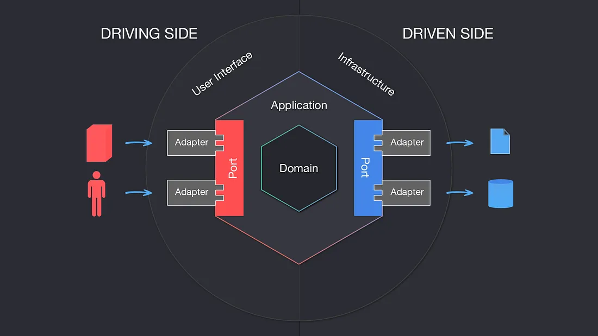

# User Authentication With Go, MongoDB And JWT

- [Getting Started](#getting-started)
- [Hexagonal Architecture](#hexagonal-architecture)


## Why I Did This?
As a Java developer, I felt like I was stuck in a time machine. Then I heard about this hip new language called Go, and
thought, "Hey, if it's good enough for the cool kids at Google, it's good enough for me!"

## What We Have Here?
A simple backend server designed with hexagonal architecture to demonstrate how user authentication can be implemented.

## We Can Find Here Stuff like:
### User Registration
- Allows new users to create an account and securely stores user data with hashed password in the MongoDB

### User Login
- Verifies provided credentials against stored information in the database and authenticates users

### JWT Token for Logged-in Users
- Generates a JSON Web Token (JWT) upon successful login
- Contains encoded user information and possibly authorization details
- Used for authenticating subsequent requests from the client

## Hexagonal Architecture

[Why Hexagonal Architecture?](https://en.wikipedia.org/wiki/Hexagonal_architecture_(software))

## Getting started
The application registers new users in a MongoDB database. 

### MongoDB Inside Docker
We can conveniently start an MongoDB instance in a Docker container. The corresponding Docker Compose file is already located in the root directory. 
<br>You can execute the compose.yml with the following command:
```bash
docker compose up -d
```

### Running the Go Application
After starting the MongoDB container, the Go application can be launched using the following terminal command:
```bash
go run cmd/main.go
```

### Registering a New User
To register a new user, an HTTP POST request can be sent to the appropriate endpoint with a body containing the user 
credentials. Here's how you might do this:
```bash
curl -v -X POST http://localhost:8080/user/register \
-H "Content-Type: application/json" \
-d '{
  "username": "testuser",
  "password": "test123"
}'
```

## License
This project is licensed under the MIT License - see the [LICENSE](LICENSE.txt) file for details.


